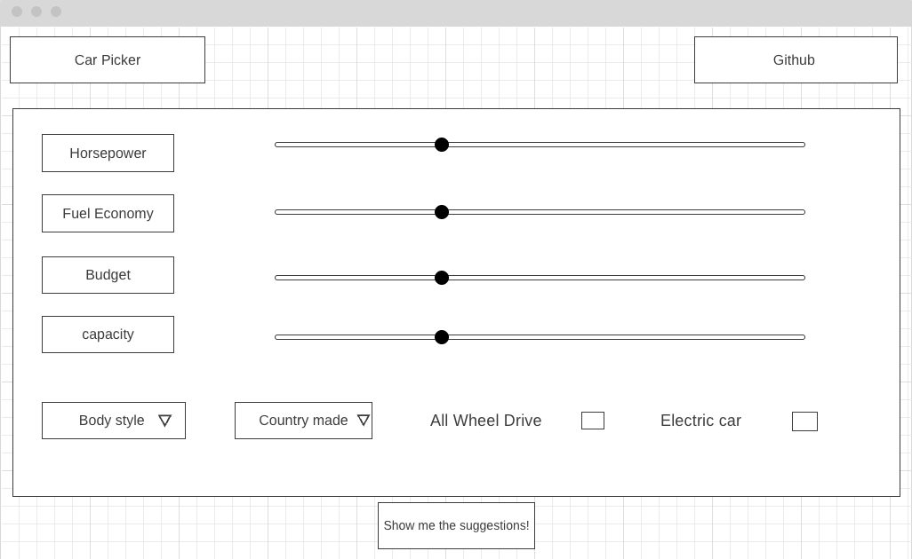

# Car Picker

JS Project :red_car: :oncoming_automobile:
Click here: https://ronnydeng67.github.io/Car-Picker/

## Background

Car Picker is a data visualiztion webapp that provide car suggestions to user based on the user's preferences. Perform a car search by features/criteria most vital to the users, disvover new car for users accourding to user's selections.

## Functionality & MVPs

In Car Picker, users will be able to:

- Use slider to choose their interest level on certain features
- Choose from 8 different car preferences 
- View 2-3 cars as result after submit their selections
- View chart comparison in different specs from the filtered out cars

## Technologies, APIs

- Unsplash API
- Fetch API

## Wireframe

## Implementation Timeline

- Friday Afternoon & Weekend: Research for essential resources for the project
- Monday: Start working on backend logic 
- Tuesday: Move to frontend
- Wednesday: Work on frontend
- Thursday Morning: Keep working on fronted, hope able to finish up to 80%