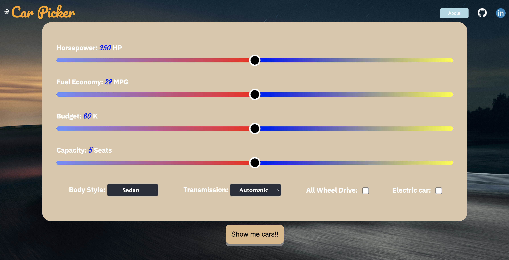

# Car Picker

JS Project :red_car: :oncoming_automobile:
Click here: [Car Picker](https://ronnydeng67.github.io/Car-Picker/)

## Background

Car Picker is a data visualization web application that provide car suggestions to user based on the user's preferences. Perform a car search by features/criteria most vital to the users, discover new cars for users according to user's selections.

- Preferences page:

- Result page:

## Functionality & MVPs

In Car Picker, users will be able to:

- Use slider to choose their preference on features
- Choose from 8 different car preferences 
- View 2 car's images and car's information as result after submit their selections

## Technologies, APIs

- Unsplash API
- Fetch API

## Wireframe

