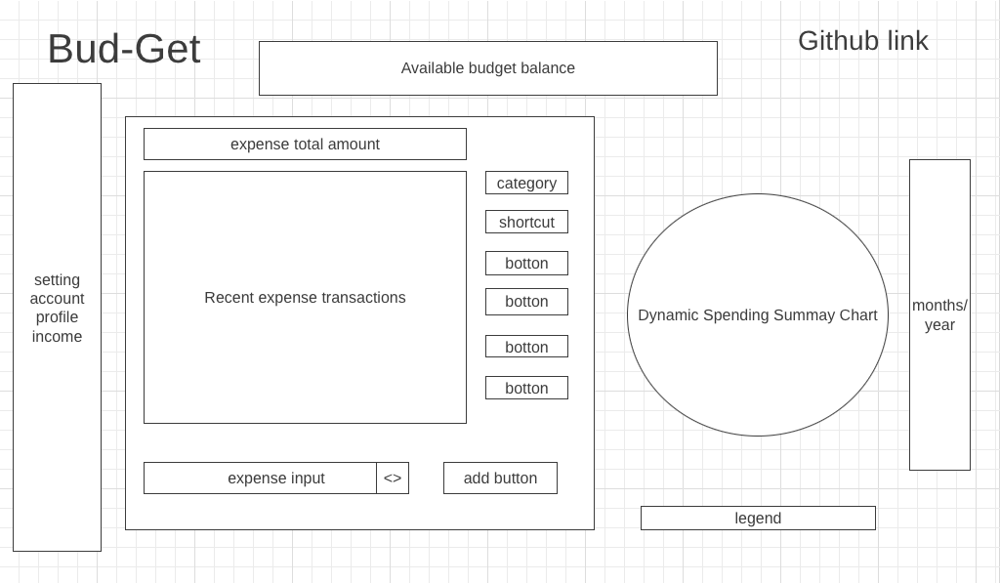

# Bud-Get

JS Project :money_with_wings: :money_with_wings:

## Background

Bud-Get is a data visualiztion webapp that provide money management to users. Featuring with personalized insights, custom budgets, spend and investment tracking. Easily monitor your monthly incomes and expenses, building stronger financial habits.

## Functionality & MVPs

In Bud-Get, users will be able to:

- Monior cash flow by tracking user's income and expenses
- Adding expenses rapidly by selecting from the the provided spending categories
- Set up periodic(recurring) expenses
- View spending summary from dynamic chart

## Wireframe

## Implementation Timeline

- Friday Afternoon & Weekend: Research for essential resources for the project
- Monday: Start working on backend logic 
- Tuesday: Move to frontend
- Wednesday: Work on frontend
- Thursday Morning: Keep working on fronted, hope able to finish up to 80%